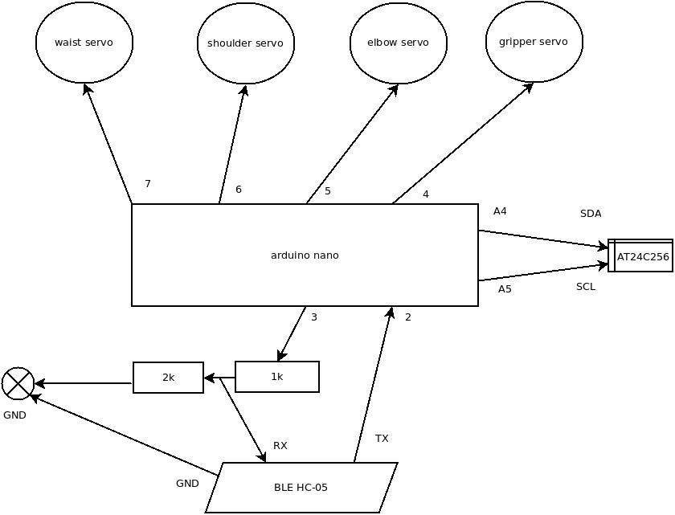

# miniarm

## miniarm (arduino application)

The platform is from [romanian site](https://www.optimusdigital.ro/en/robot-kits/8148-mini-robotic-arm-kit.html)

But is similar with [amazon site](https://www.amazon.com/Raspberry-SNAM1500-Robotic-Mechanical-Arduino/dp/B07T7ML7DF)

AT24C256 I2C external EEPROM.

HC-06 BLE.

### This supports the following commands:

Those commands could be also used with any bluetooth terminal like Arduino Bluetooth (but be sure that you have \n terminator).

#### basic commands :
- wxx# move the waist to xx degree
- sxx# move the shoulder ot xx degree
- exx# move the elbow to xx degree
- gxx# move the gripper to xx degree
- dxx# delay in miliseconds

#### advanced commands :
- S<basic_command> save the command for later use if is direct mode it will write to external EEPROM otherwise into local memory
- Rf# run the commands in the forward order (in the send order)
- Rr# run the commands in the reverse order
- C# clear all saved commands
- Ed# set direct mode (to write to external EEPROM)
- ED# set direct loop mode (to execute commands from EEPROM forward and then reverse)
- Ea# write all commands from internal memory to external EEPROM
- El# set load from EEPROM at startup into internal memory
- EL# set load mode and loop mode

### Logical connections

## miniarm control center (android application)
android control center for robotic mini arm
